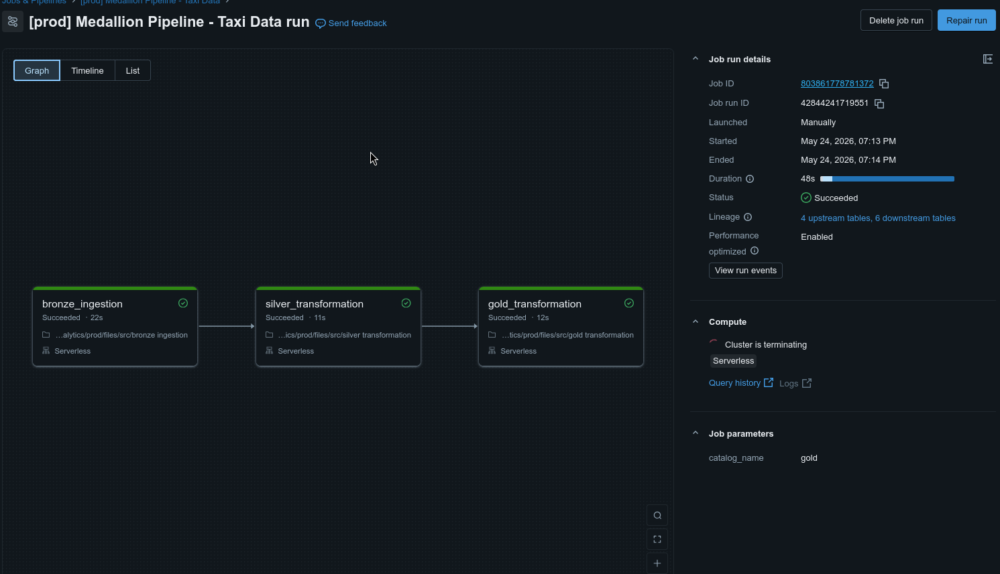
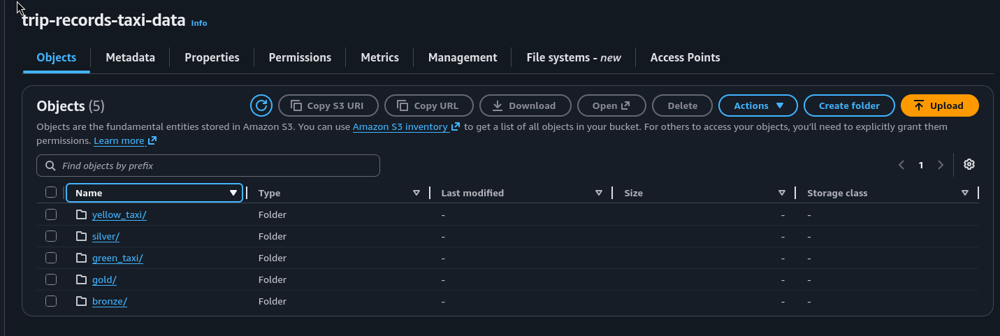

# iFood Case - Arquiteto/Engenheiro de Dados

## Visão Geral
Este projeto implementa um pipeline completo de dados para ingestão, transformação e análise de dados de corridas do NYC Yellow e Green Taxi de janeiro a maio de 2023, seguindo o padrão da Arquitetura Medallion (Bronze → Silver → Gold).

O projeto utiliza **Declarative Automation Bundles (DABs)** para orquestração e implantação automatizada de todo o pipeline de dados como código.

### 📌 Sobre a Inclusão do Green Taxi

**Nota importante:** O case técnico solicita explicitamente dados de **Yellow Taxi**. Além destes, incluímos também **Green Taxi** por três razões estratégicas:

1. **Análise Comparativa Completa**: Permite comparar métricas entre os dois tipos de táxi licenciados pela NYC TLC, gerando insights mais ricos sobre o mercado de transporte de NYC
2. **Demonstração de Escalabilidade**: Mostra capacidade de processar múltiplas fontes de dados com schemas similares mas não idênticos (green taxi não possui `airport_fee`, por exemplo)
3. **Contexto de Negócio**: Green taxi foi criado em 2013 para atender áreas fora de Manhattan (Bronx, Brooklyn, Queens), enquanto Yellow tem exclusividade em Manhattan e aeroportos. Esta inclusão demonstra compreensão do domínio de negócio NYC TLC

**Todos os requisitos do case foram atendidos com os dados de Yellow Taxi.** A inclusão de Green Taxi é um **adicional** que enriquece a análise sem comprometer os objetivos principais.

## Arquitetura

### Camadas de Dados (Medallion Architecture)
1. **Camada Bronze** (`bronze.taxidata`): Ingestão de dados brutos do S3
   - Fontes: 
     - NYC TLC Yellow Taxi Trip Records (~16.2M registros)
     - NYC TLC Green Taxi Trip Records (~340K registros)
   - Formato: Arquivos Parquet do S3 (um arquivo por mês)
   - Período: Janeiro - Maio 2023
   - Leitura arquivo a arquivo com `unionByName(allowMissingColumns=True)` para diferenças de schema entre meses/tipos
   - Casts de tipos via `cast_bronze_columns()` + timestamp de ingestão

2. **Camada Silver** (`silver.taxidata`): Dados limpos e padronizados
   - Colunas renomeadas para nomes business-friendly
   - Nulos removidos apenas em colunas críticas via `.dropna(subset=[...])`
   - Filtro de período (2023-01-01 a 2023-05-31), `total_amount >= 0` e `dropoff >= pickup`
   - Tipos de dados padronizados
   - Dados prontos para análise
   - Yellow: ~15.8M registros | Green: ~317K registros

3. **Camada Gold** (`gold.taxidata`): Dados consolidados para análise de negócio
   - Colunas essenciais selecionadas para análise
   - Schema simplificado focado em KPIs principais
   - Dados otimizados para consultas analíticas
   - Yellow: ~15.8M registros | Green: ~317K registros

4. **Data Quality Validation**: Validações automatizadas de qualidade de dados
   - Executado após transformação Silver
   - Valida integridade, consistência e conformidade dos dados
   - Garante qualidade antes de promover para Gold

### Orquestração com DABs
O projeto utiliza Declarative Automation Bundles para:
- **Implantação automatizada** de notebooks e jobs
- **Orquestração de tarefas** com dependências (Bronze → Silver → Data Quality → Gold)
- **Versionamento** de configurações como código

## Estrutura do Projeto

```
ifood-case/
├── databricks.yml                    # Configuração principal do Bundle
├── resources/
│   └── medallion.job.yml            # Definição do Job orquestrado
├── src/
│   ├── pipeline_utils.py            # Funções compartilhadas (Bronze, Silver, DQ)
│   ├── bronze ingestion.ipynb       # Ingestão de dados do S3 para Bronze
│   ├── silver transformation.ipynb  # Transformação Bronze → Silver
│   ├── DQ_silver.ipynb              # Validações de Qualidade de Dados (Silver)
│   └── gold transformation.ipynb    # Consolidação Silver → Gold
├── tests/
│   ├── conftest.py                  # Configuração do pytest
│   └── test_pipeline.py             # Testes unitários da lógica compartilhada
├── analysis/
│   ├── analysis.ipynb               # Respostas às questões do case
│   └── Agente Text-to-SQL.ipynb     # Agente IA de geração de SQL
├── README.md                         # Este arquivo
└── requirements.txt                  # Dependências Python
```

### Funções compartilhadas (`src/pipeline_utils.py`)

Lógica repetida entre notebooks foi extraída para um único arquivo:

| Função | Uso |
|--------|-----|
| `cast_bronze_columns(df)` | Casts de tipos e normalização de `airport_fee` na Bronze |
| `silver_sql(taxi_type)` | SQL de transformação Silver (yellow/green) |
| `validar_silver(spark, table)` | Validações de qualidade na camada Silver |

Constantes centralizadas: `DATE_START`, `DATE_END`, `S3_BASE`, `SILVER_DROPNA_SUBSET`.

## Tecnologias Utilizadas
- **Plataforma**: Databricks Community Edition
- **Armazenamento**: AWS S3 (landing zone)
- **Formato de Dados**: Delta Lake
- **Processamento**: PySpark + Databricks SQL
- **Catálogo**: Unity Catalog (catálogos `bronze`, `silver`, `gold` + schema `taxidata`)
- **Orquestração**: Declarative Automation Bundles (DABs)
- **Testes**: pytest (lógica em `pipeline_utils.py`)
- **IA/ML**: Databricks Foundation Models (Llama 4 Maverick)

## Pipeline de Dados

### 1. Camada Bronze - Ingestão de Dados
**Notebook**: `src/bronze ingestion.ipynb`

**Processo de Ingestão**:
```python
from pyspark.sql.functions import current_timestamp

from pipeline_utils import S3_BASE, cast_bronze_columns

file_list = dbutils.fs.ls(f"{S3_BASE}yellow_taxi/")
parquet_files = [f.path for f in file_list if f.path.endswith(".parquet")]

# Lê cada mês e une com tolerância a colunas ausentes (ex: airport_fee)
dfs = [cast_bronze_columns(spark.read.parquet(f)) for f in parquet_files]
df_combined = dfs[0]
for df in dfs[1:]:
    df_combined = df_combined.unionByName(df, allowMissingColumns=True)

df_combined = df_combined.withColumn("ingestion_timestamp", current_timestamp())

df_combined.write.format("delta").mode("overwrite").option("overwriteSchema", "true") \
    .saveAsTable("bronze.taxidata.yellow_taxi_data")
```

**Tabelas Criadas**:
- `bronze.taxidata.yellow_taxi_data`: 16.186.386 registros
- `bronze.taxidata.green_taxi_data`: 339.630 registros

**Colunas Bronze** (formato original):
- VendorID, passenger_count, trip_distance
- tpep_pickup_datetime, tpep_dropoff_datetime (yellow)
- lpep_pickup_datetime, lpep_dropoff_datetime (green)
- PULocationID, DOLocationID
- fare_amount, total_amount, payment_type
- E outras 10+ colunas específicas de cada tipo

### 2. Camada Silver - Transformação de Dados
**Notebook**: `src/silver transformation.ipynb`

**Transformações aplicadas**:
- Renomeação de colunas (nomes business-friendly)
- Remoção de nulos apenas em colunas críticas (`.dropna(subset=SILVER_DROPNA_SUBSET)`)
- Filtro de período (Jan-Mai 2023), valores negativos e corridas inválidas (`dropoff < pickup`)
- SQL gerado por `silver_sql("yellow")` / `silver_sql("green")` em `pipeline_utils.py`

**Tabelas Criadas**:
- `silver.taxidata.yellow_taxi_data`: 15.757.617 registros
- `silver.taxidata.green_taxi_data`: 316.725 registros

**Colunas Silver** (padronizadas):
- `id_vendor`: Identificador do fornecedor
- `pickup_datetime`: Data/hora de início da corrida
- `dropoff_datetime`: Data/hora de fim da corrida
- `nr_passenger`: Número de passageiros
- `distance`: Distância percorrida
- `id_ratecode`: Código de tarifa
- `fl_store_fwd`: Flag store and forward
- `id_pickup`: ID da localização de pickup
- `id_dropoff`: ID da localização de dropoff
- `cd_payment`: Código do método de pagamento
- `vl_fare`: Valor da tarifa base
- `vl_extra`: Valores extras
- `vl_tax`: Impostos
- `vl_tip`: Gorjeta
- `vl_tolls`: Pedágios
- `surcharge`: Sobretaxa de melhoria
- `vl_total`: Valor total da corrida
- `vl_surcharge_congestion`: Sobretaxa de congestionamento
- `vl_airport_fee`: Taxa aeroportuária (yellow only)

### 3. Data Quality Validation
**Notebook**: `src/DQ_silver.ipynb`

**Validações Executadas** (via `validar_silver()` para Yellow e Green):
- Valores negativos em `vl_total`, `nr_passenger` e `distance`
- Período entre 2023-01-01 e 2023-05-31
- Nulos em colunas críticas (`id_vendor`, `vl_total`, `nr_passenger`, `pickup_datetime`)

**Benefícios**:
- ✅ **Detecção precoce**: Problemas identificados antes de propagarem para Gold
- ✅ **Fail-fast**: Pipeline para se encontrar dados inválidos
- ✅ **Auditoria**: Logs de validação documentam qualidade em cada execução
- ✅ **Confiabilidade**: Garante conformidade com regras de negócio

### 4. Camada Gold - Dados Consolidados para Análise
**Notebook**: `src/gold transformation.ipynb`

**Transformações aplicadas**:
- Seleção de colunas essenciais para análise de negócio
- Renomeação final para nomenclatura business-friendly
- Schema simplificado focado em KPIs

**Tabelas Criadas**:
- `gold.taxidata.yellow_taxi_data`: 15.757.617 registros
- `gold.taxidata.green_taxi_data`: 316.725 registros

**Colunas Gold** (essenciais):
- `id_vendor`: Identificador do fornecedor
- `dh_inicio_corrida`: Data/hora de início
- `dh_final_corrida`: Data/hora de fim
- `vl_total_corrida`: Valor total da corrida
- `nr_passageiros`: Número de passageiros

## Como Executar

### Pré-requisitos
- Conta Databricks Community Edition
- Acesso ao bucket S3: `s3://trip-records-taxi-data/`
- Databricks CLI instalado (para deployment do Bundle)

### Opção 1: Execução com DABs (Recomendado)

#### 1. Deploy do Bundle
```bash
# Validar configuração
databricks bundle validate --target prod

# Deploy no workspace
databricks bundle deploy --target prod
```

#### 2. Executar o Job Orquestrado
```bash
# Executar pipeline completo (Bronze → Silver → Data Quality → Gold)
databricks bundle run medallion_pipeline --target prod
```

O job executará automaticamente as 4 tarefas em sequência:
1. `bronze_ingestion`: Ingestão de Yellow e Green taxi do S3
2. `silver_transformation`: Limpeza, padronização e filtros
3. `data_quality`: Validações automatizadas de qualidade
4. `gold_transformation`: Consolidação para análise de negócio

#### 3. Executar Análise
- Abrir `analysis/analysis.ipynb`
- Executar todas as células para ver as respostas

### Testes unitários (local ou Databricks)

Validam a lógica de `pipeline_utils.py` antes de rodar o pipeline:

```bash
pip install pytest pyspark   # pyspark opcional para 1 teste de dropna
pytest tests/ -v
```

No Databricks (com o repo clonado):

```bash
%pip install pytest
%sh pytest /Workspace/Repos/<seu-usuario>/ifood-case/tests/ -v
```

### Opção 2: Execução Manual (Passo a Passo)

#### 1. Criar Schemas no Unity Catalog
```sql
CREATE SCHEMA IF NOT EXISTS bronze.taxidata;
CREATE SCHEMA IF NOT EXISTS silver.taxidata;
CREATE SCHEMA IF NOT EXISTS gold.taxidata;
```

#### 2. Executar Ingestão Bronze
- Abrir `src/bronze ingestion.ipynb`
- Executar todas as células sequencialmente
- Verificar: ~16.5M registros carregados (yellow + green)

#### 3. Executar Transformação Silver
- Abrir `src/silver transformation.ipynb`
- Executar todas as células sequencialmente
- Verificar: ~16.1M registros limpos com colunas business-friendly

#### 4. Executar Validações de Qualidade
- Abrir `src/DQ_silver.ipynb`
- Executar todas as células sequencialmente
- Verificar: Todas as validações passaram sem erros

#### 5. Executar Consolidação Gold
- Abrir `src/gold transformation.ipynb`
- Executar todas as células sequencialmente
- Verificar: 2 tabelas gold criadas (yellow + green)

#### 6. Executar Análise
- Abrir `analysis/analysis.ipynb`
- Executar todas as células para ver as respostas

## Configuração do Bundle

### databricks.yml
O arquivo principal do Bundle define:
- **Nome do projeto**: `ifood-taxi-analytics`
- **Variáveis**: catalog, cluster_node_type
- **Ambientes**: prod (production mode)
- **Recursos**: Inclui todos os arquivos `.yml` da pasta `resources/`

### Job Orquestrado (medallion.job.yml)
O job é configurado com:
- **4 tarefas** com dependências sequenciais
- **Retry automático**: 1 tentativa por tarefa
- **Timeout**: 1 hora por tarefa e total
- **Fila habilitada**: Para controle de concorrência
- **Tags**: environment, project, architecture

**Fluxo de Execução**:
```
bronze_ingestion (Yellow + Green)
        ↓
silver_transformation (Limpeza + Filtros)
        ↓
data_quality (Validações DQ)
        ↓
gold_transformation (Consolidação)
```


## Principais Decisões de Design

### 1. Arquitetura Medallion
- **Bronze**: Preserva dados brutos para auditoria e replay
- **Silver**: Dados limpos e consultáveis para analistas
- **Gold**: Dados consolidados com schema simplificado para análise de negócio

### 2. Formato Delta Lake
- Transações ACID
- Capacidades de time travel
- Suporte à evolução de schema
- Performance superior ao Parquet
- Compressão automática

### 3. Unity Catalog
- Gerenciamento centralizado de metadados
- Organização por catálogos (`bronze`, `silver`, `gold`) e schema de domínio (`taxidata`)
- Governança de dados embutida
- Linhagem de dados rastreável

### 4. Declarative Automation Bundles (DABs)
- **Infraestrutura como código**: Toda configuração versionada
- **Deployment automatizado** via Databricks CLI
- **Orquestração nativa**: Dependências entre tarefas
- **Reprodutibilidade**: Deploy consistente no workspace

### 5. Estratégia de Nomenclatura de Colunas

**Decisão arquitetural:** Aplicamos diferentes convenções de nomenclatura por camada para equilibrar conformidade com dados brutos e usabilidade para análise de negócio.

#### Bronze Layer - Nomenclatura Original
**Mantém os nomes da fonte NYC TLC**, com casts mínimos de tipo aplicados em `cast_bronze_columns()` (ex: `VendorID`, `passenger_count`, `total_amount`, `tpep_pickup_datetime`):

**Justificativa:**
- ✅ **Auditoria e rastreabilidade**: Permite verificação direta contra dados originais
- ✅ **Conformidade com fonte**: Facilita debugging e troubleshooting com documentação oficial da NYC TLC
- ✅ **Idempotência**: Reprocessamento sempre produz mesma estrutura
- ✅ **Time travel**: Delta Lake permite voltar ao estado original dos dados

#### Silver/Gold Layers - Nomenclatura Business-Friendly
**Aplica padrão padronizado** (ex: `id_vendor`, `nr_passageiros`, `vl_total_corrida`, `dh_inicio_corrida`, `dh_final_corrida`):

**Justificativa:**
- ✅ **Usabilidade para analistas**: Nomes em português e autoexplicativos reduzem curva de aprendizado
- ✅ **Padrão corporativo**: Segue convenção de nomenclatura amplamente adotada em empresas brasileiras
- ✅ **Tipagem clara**: Prefixos indicam tipo de dado (id_, vl_, nr_, dh_, fl_, cd_)
- ✅ **Manutenibilidade**: Facilita onboarding de novos membros do time

**Convenção aplicada:**
- `id_*`: Identificadores (ex: `id_vendor`, `id_pickup`, `id_dropoff`)
- `vl_*`: Valores monetários (ex: `vl_total_corrida`, `vl_fare`, `vl_tip`)
- `nr_*`: Números/contadores (ex: `nr_passageiros`)
- `fl_*`: Flags booleanos (ex: `fl_store_fwd`)
- `cd_*`: Códigos (ex: `cd_payment`, `id_ratecode`)
- `dh_*`: Data/hora (ex: `dh_inicio_corrida`, `dh_final_corrida`)

**Mapeamento de colunas requeridas pelo case:**

| Case Requerido | Bronze (Original) | Silver/Gold (Padronizado) |
|----------------|-------------------|---------------------------|
| VendorID | VendorID | id_vendor |
| passenger_count | passenger_count | nr_passageiros |
| total_amount | total_amount | vl_total_corrida |
| tpep_pickup_datetime | tpep_pickup_datetime | dh_inicio_corrida |
| tpep_dropoff_datetime | tpep_dropoff_datetime | dh_final_corrida |

**✅ Todas as 5 colunas requeridas pelo case estão presentes e preservadas em todas as camadas.**

### 6. Processamento de Múltiplas Fontes
- Yellow e Green taxi processados separadamente na Bronze
- União mensal com `unionByName(allowMissingColumns=True)` na ingestão
- União (UNION) na camada de análise quando necessário
- Preservação das diferenças de schema entre tipos de táxi (ex: `airport_fee` só no Yellow)

### 7. Separação de Data Quality Validation
**Decisão arquitetural:** Validações de qualidade foram isoladas em notebook dedicado (`DQ_silver.ipynb`) após a transformação Silver, com regras centralizadas em `validar_silver()` no `pipeline_utils.py`.

**Justificativa:**
- ✅ **Separação de responsabilidades**: Transformação e validação são processos distintos
- ✅ **Reusabilidade**: A mesma função valida Yellow e Green taxi
- ✅ **Manutenibilidade**: Regras de qualidade em um único lugar
- ✅ **Visibilidade**: Status de qualidade explícito no fluxo de orquestração
- ✅ **Fail-fast**: Falhas de qualidade param o pipeline antes de contaminar Gold

### 8. Testes unitários
**Decisão:** Lógica compartilhada testada com pytest localmente, sem depender do cluster Databricks.

- Testes de SQL Silver (yellow/green) rodam sem Spark
- Teste de `dropna(subset=...)` valida que colunas opcionais (ex: gorjeta) não descartam a linha inteira

## Verificações de Qualidade de Dados

### Notebook Dedicado de Data Quality
**Notebook**: `src/DQ_silver.ipynb`

As validações de qualidade de dados foram implementadas em um notebook dedicado, executado após a transformação Silver e antes da consolidação Gold. Esta separação traz benefícios arquiteturais importantes.

### Validações Implementadas

A função `validar_silver()` executa as seguintes validações para Yellow e Green taxi:

#### 1. Validação de Valores Negativos
```python
# Garante que não existam valores negativos em colunas numéricas
assert vl_total >= 0
assert nr_passenger >= 0
assert distance >= 0
```

#### 2. Validação de Período
```python
# Confirma que todos os registros estão dentro do intervalo Jan-Mai 2023
assert MIN(DATE(pickup_datetime)) >= '2023-01-01'
assert MAX(DATE(pickup_datetime)) <= '2023-05-31'
```

#### 3. Validação de Valores Nulos
```python
# Verifica que não há nulos nas colunas críticas após dropna(subset=...)
assert COUNT(*) WHERE id_vendor IS NULL = 0
assert COUNT(*) WHERE vl_total IS NULL = 0
assert COUNT(*) WHERE nr_passenger IS NULL = 0
assert COUNT(*) WHERE pickup_datetime IS NULL = 0
```

### Benefícios da Arquitetura de Data Quality Separada

- ✅ **Separação de responsabilidades**: Transformação e validação são processos independentes
- ✅ **Reusabilidade**: Validações podem ser aplicadas em outros pipelines ou camadas
- ✅ **Manutenibilidade**: Regras de qualidade centralizadas em um único lugar
- ✅ **Visibilidade**: Status de qualidade explícito no fluxo de orquestração DABs
- ✅ **Fail-fast**: Falhas de qualidade param o pipeline antes de dados inválidos chegarem ao Gold
- ✅ **Auditoria**: Logs isolados facilitam troubleshooting e compliance
- ✅ **Escalabilidade**: Novas validações podem ser adicionadas sem modificar transformações

### Checklist de Qualidade Geral

- ✅ Todas as colunas requeridas presentes em todas as camadas
- ✅ Nulos removidos apenas em colunas críticas na Silver (`.dropna(subset=...)`)
- ✅ Tipos de dados validados e convertidos no Bronze
- ✅ Intervalo de tempo verificado (Jan-Mai 2023)
- ✅ Contagens de registros validadas entre camadas:
  - Bronze → Silver: ~3% perda (dados nulos + fora do período)
  - Silver → Gold: 100% preservação
- ✅ Pipeline executado end-to-end com sucesso
- ✅ Timestamp de ingestão adicionado no Bronze
- ✅ Validações automatizadas executadas em notebook dedicado (DQ_silver.ipynb)

## Volume de Dados Processados

| Camada | Yellow Taxi | Green Taxi | Total |
|--------|-------------|------------|-------|
| **Bronze** | 16.186.386 | 339.630 | 16.526.016 |
| **Silver** | 15.757.617 | 316.725 | 16.074.342 |
| **Gold** | 15.757.617 | 316.725 | 16.074.342 |

**Perda de dados Bronze → Silver**: ~450K registros (2.7%)
- Motivo: Valores nulos removidos + registros fora do período Jan-Mai 2023

## Respostas às Perguntas do Case

**Pergunta 1** — média de valor total por corrida (`AVG` de `vl_total_corrida`), agrupada por mês, considerando todos os yellow táxis da frota.

**Pergunta 2** — média de passageiros por hora do dia em maio/2023, unindo Yellow e Green taxi.

Detalhes e visualizações em `analysis/analysis.ipynb`.

## Queries de Exemplo

### Ticket Médio por Mês (Yellow Taxi)
```sql
SELECT 
  month(dh_inicio_corrida) AS mes,
  ROUND(AVG(vl_total_corrida), 2) AS media_valor_corrida
FROM gold.taxidata.yellow_taxi_data
GROUP BY mes
ORDER BY mes;
```

### Receita Total por Mês (Yellow Taxi)
```sql
SELECT 
  month(dh_inicio_corrida) AS mes,
  SUM(vl_total_corrida) AS receita_total
FROM gold.taxidata.yellow_taxi_data
GROUP BY mes
ORDER BY mes;
```

### Comparação Yellow vs Green Taxi
```sql
SELECT 
  'Yellow' AS tipo_taxi,
  COUNT(*) AS total_corridas,
  AVG(vl_total_corrida) AS ticket_medio,
  AVG(nr_passageiros) AS passageiros_medio
FROM gold.taxidata.yellow_taxi_data

UNION ALL

SELECT 
  'Green' AS tipo_taxi,
  COUNT(*) AS total_corridas,
  AVG(vl_total_corrida) AS ticket_medio,
  AVG(nr_passageiros) AS passageiros_medio
FROM gold.taxidata.green_taxi_data;
```

### Distribuição de Corridas por Fornecedor
```sql
SELECT 
  id_vendor,
  COUNT(*) AS total_corridas,
  ROUND(AVG(vl_total_corrida), 2) AS ticket_medio
FROM gold.taxidata.yellow_taxi_data
GROUP BY id_vendor
ORDER BY total_corridas DESC;
```

## 🤖 Agente de IA Text-to-SQL

### Visão Geral

Desenvolvemos um **agente inteligente de geração de SQL** usando o Databricks Foundation Models para democratizar o acesso aos dados através de linguagem natural. O agente permite que usuários de negócio façam perguntas em português e recebam automaticamente queries SQL executadas contra as tabelas do Unity Catalog.

**Notebook**: `analysis/Agente Text-to-SQL.ipynb`

### Arquitetura do Agente

O agente foi construído com um sistema completo de produção que inclui:

- **Geração de SQL**: Usa Llama 4 Maverick (17B parâmetros ativos, 128K tokens de contexto)
- **Validação**: Verifica sintaxe e bloqueia comandos perigosos (DROP, DELETE, etc)
- **Execução**: Roda queries contra tabelas reais do Unity Catalog
- **Auto-correção**: Retry automático com contexto de erro (até 3 tentativas)
- **Histórico**: Mantém log de queries para aprendizado e auditoria

### Tecnologias Utilizadas

- **LLM**: Databricks Foundation Model - Llama 4 Maverick
- **Framework**: Mosaic AI Agent Framework
- **API**: MLflow Deployments Client
- **Processamento**: PySpark para execução de queries
- **Validação**: Spark SQL EXPLAIN para verificação de sintaxe

### Schema Context

O agente possui conhecimento completo do schema das tabelas Gold:

```python
SCHEMA_CONTEXT = """
## Schema do Banco de Dados - Dados de Táxi

### Tabela: gold.taxidata.yellow_taxi_data
- id_vendor (LONG): ID do fornecedor/empresa de táxi
- dh_inicio_corrida (TIMESTAMP_NTZ): Data e hora de início da corrida
- dh_final_corrida (TIMESTAMP_NTZ): Data e hora de término da corrida
- vl_total_corrida (DOUBLE): Valor total cobrado pela corrida em dólares
- nr_passageiros (DOUBLE): Número de passageiros na corrida

### Tabela: gold.taxidata.green_taxi_data
(Mesma estrutura da yellow_taxi_data)

## Notas importantes:
- Use TIMESTAMP_NTZ para filtros de data/hora
- Para calcular duração: dh_final_corrida - dh_inicio_corrida
- Valores monetários em dólares (USD)
- Use UNION ALL para combinar as duas tabelas
"""
```

### Exemplos de Uso Testados

#### Exemplo 1: Contagem de Corridas por Período
**Pergunta**: "Quantas corridas de táxi amarelo tivemos nos 30 dias de abril em 2023?"

**SQL Gerado**:
```sql
SELECT 
    COUNT(*) AS qt_corridas 
FROM 
    gold.taxidata.yellow_taxi_data 
WHERE 
    dh_inicio_corrida >= '2023-04-01' 
    AND dh_inicio_corrida < '2023-05-01'
LIMIT 100;
```

**Resultado**: 3.167.803 corridas em abril de 2023

#### Exemplo 2: Análise de Receita com CTE
**Pergunta**: "Qual foi a receita total de corridas de táxi verde vs amarelo?"

**SQL Gerado**:
```sql
WITH 
    receita_total_verde AS (
        SELECT 
            SUM(vl_total_corrida) AS total_verde
        FROM 
            gold.taxidata.green_taxi_data
    ),
    receita_total_amarelo AS (
        SELECT 
            SUM(vl_total_corrida) AS total_amarelo
        FROM 
            gold.taxidata.yellow_taxi_data
    )
SELECT 
    total_verde, 
    total_amarelo
FROM 
    receita_total_verde, 
    receita_total_amarelo
LIMIT 100;
```

**Resultado**:
| Total Verde (USD) | Total Amarelo (USD) |
|-------------------|---------------------|
| $7,000,728.21 | $441,247,858.04 |

**Insight**: Táxis amarelos geraram ~63x mais receita que os verdes

#### Exemplo 3: Cálculos Temporais Avançados
**Pergunta**: "Qual é a duração média das corridas de táxi em minutos?"

**SQL Gerado**:
```sql
WITH corridas_combinadas AS (
  SELECT 
    dh_inicio_corrida,
    dh_final_corrida
  FROM gold.taxidata.yellow_taxi_data
  UNION ALL
  SELECT 
    dh_inicio_corrida,
    dh_final_corrida
  FROM gold.taxidata.green_taxi_data
)
SELECT 
  AVG(TIMESTAMPDIFF(MINUTE, dh_inicio_corrida, dh_final_corrida)) AS duracao_media_minutos
FROM corridas_combinadas
LIMIT 100;
```

**Resultado**: ~16.35 minutos de duração média

#### Exemplo 4: Análise Temporal por Hora
**Pergunta**: "Quantas corridas acontecem por hora do dia em média?"

**SQL Gerado**: Query complexa com CTEs aninhados, agregações múltiplas e GROUP BY

**Resultado - Horários de Pico**:
- **18h (6 PM)**: ~1,14 milhão de corridas (maior pico)
- **16h (4 PM)**: ~1,00 milhão de corridas
- **12h (meio-dia)**: ~877 mil corridas
- **4h (madrugada)**: ~80 mil corridas (menor movimento)

### Capacidades do Agente

✅ **Geração Inteligente de SQL**
- Queries complexas com JOINs, CTEs, agregações múltiplas
- Suporte a UNION ALL para combinar múltiplas tabelas
- Cálculos temporais (duração, hora do dia, diferenças)
- Aliases descritivos em português
- Filtros de período inteligentes

✅ **Validação e Segurança**
- Bloqueia comandos perigosos (DROP, DELETE, ALTER, TRUNCATE)
- Valida sintaxe SQL antes de executar (via EXPLAIN)
- Aceita CTEs (Common Table Expressions)
- Verifica colunas contra schema definido
- Suporta apenas queries SELECT

✅ **Execução e Resultados**
- Executa queries contra tabelas reais do Unity Catalog
- Retorna dados em DataFrame pandas para análise
- Limite de segurança de 1000 linhas por query
- Display automático de resultados tabulares
- Tratamento de erros com mensagens descritivas

✅ **Auto-correção Inteligente**
- Retry automático em caso de erro (até 3 tentativas)
- Contexto de erro passado para próxima tentativa
- Histórico completo de queries para aprendizado
- Correção automática de sintaxe e aliases
- Logs detalhados de cada tentativa

### Como Usar o Agente

#### 1. Inicializar o Agente
```python
# O agente já está inicializado no notebook
agent = TextToSQLAgent(
    model_name="databricks-llama-4-maverick",
    schema_context=SCHEMA_CONTEXT
)
```

#### 2. Fazer Perguntas em Linguagem Natural
```python
result = agent.answer_question("Quantas corridas tivemos no total?")

if result['success']:
    display(result['data'])
    print(f"SQL: {result['sql']}")
else:
    print(f"Erro: {result['error']}")
```

#### 3. Acessar Histórico de Queries
```python
# Ver todas as queries executadas
for query in agent.query_history:
    print(f"Pergunta: {query['question']}")
    print(f"SQL: {query['sql']}")
    print(f"Sucesso: {query.get('success', False)}")
    print(f"Tentativas: {query.get('attempt', 1)}")
```

### Benefícios do Agente

🎯 **Democratização de Dados**
- Usuários de negócio acessam dados sem conhecer SQL
- Reduz dependência do time de dados
- Acelera análises ad-hoc e exploratórias

🚀 **Produtividade**
- Gera queries complexas em segundos
- Elimina erros de sintaxe comuns
- Auto-correção reduz iterações manuais
- Histórico permite reutilização de queries

🔒 **Segurança**
- Validação automática antes de execução
- Bloqueia operações destrutivas (DROP, DELETE)
- Limite de resultados para performance
- Logs de auditoria completos

📊 **Qualidade**
- Queries seguem best practices SQL
- Nomes de colunas padronizados
- Resultados sempre validados
- CTEs para queries complexas

### Possibilidades de Extensão

O agente pode ser evoluído para:
- 🌐 **Interface Web**: Deploy como API REST ou Streamlit app
- 💬 **Integração Slack/Teams**: Bot conversacional para equipes
- 📈 **Visualizações Automáticas**: Gráficos gerados automaticamente após execução
- 🔍 **RAG com Vector Search**: Memória de queries similares para sugestões
- 🎯 **Recomendações**: Sugestão de análises baseada no histórico
- 🔐 **Governança**: Logs de auditoria e controle de acesso por usuário
- 📊 **Dashboard Automático**: Criação de dashboards baseados em perguntas frequentes

## Resultados do Pipeline

O pipeline executou com sucesso:
- ✅ Ingestão de 16.5M+ viagens de táxi do S3 (Yellow + Green)
- ✅ Transformação de dados em 3 camadas (Bronze → Silver → Gold)
- ✅ Criação de 6 tabelas Delta Lake (2 por camada)
- ✅ Resposta às duas questões de negócio com insights acionáveis
- ✅ Preservação de todas as 5 colunas requeridas pelo case em cada camada
- ✅ Utilização de PySpark para processamento distribuído
- ✅ Orquestração automatizada via DABs com 4 tarefas sequenciais
- ✅ **Testes unitários com pytest para `pipeline_utils.py`**
- ✅ **Validações automatizadas de qualidade em notebook dedicado (DQ_silver.ipynb)**
- ✅ **Agente de IA text-to-SQL funcional com 4 exemplos testados e validados**
- ✅ 5 visualizações profissionais criadas
- ✅ 15+ insights de negócio acionáveis documentados

## Comandos Úteis do Bundle

```bash
# Validar configuração
databricks bundle validate --target prod

# Deploy no workspace
databricks bundle deploy --target prod

# Executar job
databricks bundle run medallion_pipeline --target prod

# Ver status
databricks jobs list-runs --job-id <job_id>

# Destruir recursos
databricks bundle destroy --target prod
```

## Estrutura de Arquivos S3

```
s3://trip-records-taxi-data/
├── yellow_taxi/
│   ├── yellow_tripdata_2023-01.parquet
│   ├── yellow_tripdata_2023-02.parquet
│   ├── yellow_tripdata_2023-03.parquet
│   ├── yellow_tripdata_2023-04.parquet
│   └── yellow_tripdata_2023-05.parquet
└── green_taxi/
    ├── green_tripdata_2023-01.parquet
    ├── green_tripdata_2023-02.parquet
    ├── green_tripdata_2023-03.parquet
    ├── green_tripdata_2023-04.parquet
    └── green_tripdata_2023-05.parquet
```


## Contato

Para dúvidas ou problemas, abra uma issue neste repositório.

---
**Autor**: Gabriel Travaioli  
**Data**: Maio 2026  
**Plataforma**: Databricks Community Edition  
**Arquitetura**: Medallion (Bronze → Silver → Gold) + Data Quality Validation  
**Orquestração**: Declarative Automation Bundles (DABs)  
**IA/ML**: Agente Text-to-SQL com Foundation Models (Llama 4 Maverick)  
**Volume de Dados**: ~16.5M registros processados